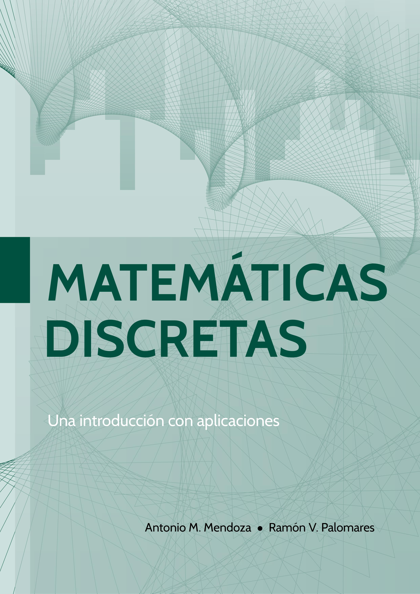
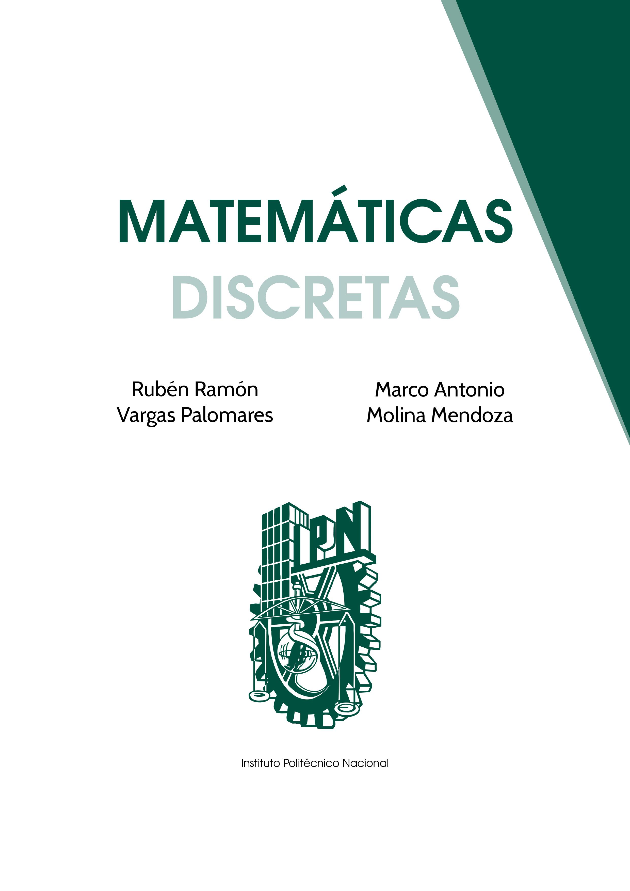

# Matemáticas Discretas

Este repositorio contiene el material y el código asociado al libro de Matemáticas Discretas, el cual está organizado en dos partes principales. Este libro está diseñado para el curso de Matemáticas Discretas que proporciona el Dr. Rubén Ramón Vargas Palomares, profesor de la Escuela Superior de Física y Matemáticas (ESFM).

## Contenido del Libro

### Parte 1: Fundamentos de la Matemática Discreta

1. **Fundamentos de lógica**: Proposiciones, tablas de verdad, leyes de la lógica.
2. **Técnicas de conteo**: Reglas de suma y producto, permutaciones, combinaciones.
3. **Teoría de conjuntos**: Conjuntos y operaciones, diagramas de Venn-Euler.
4. **Álgebra booleana**: Funciones booleanas y sus formas normales.

### Parte 2: Temas Adicionales de Conteo

5. **Relaciones y funciones**: Productos cartesianos, funciones inyectivas y sobreyectivas.
6. **Funciones generatrices**: Series de Taylor, técnicas de cálculo, función generatriz exponencial.
7. **Relaciones de recurrencia**: Relaciones lineales y no homogéneas.
8. **El principio de inclusión y exclusión**: Aplicaciones y generalizaciones.

## Apéndices

- **Inducción y buen orden**: Una introducción al Principio de Inducción y de Buen Orden junto con ejemplos.
- **Introducción a la programación en C**: Una introducción detallada a C y algunos ejemplos.

## Cómo usar

Estas notas se presentan en formato PDF para facilitar su uso y visualización. Puedes clonarlas o descargarlas para estudiarlas a tu propio ritmo.

## Descarga

Puedes descargar las notas haciendo clic en el enlace que se encuentra al principio de este repositorio.

## Contribuciones

Si tienes sugerencias o mejoras, siéntete libre de abrir una *issue* o hacer un *pull request*. ¡Tu contribución es bienvenida!